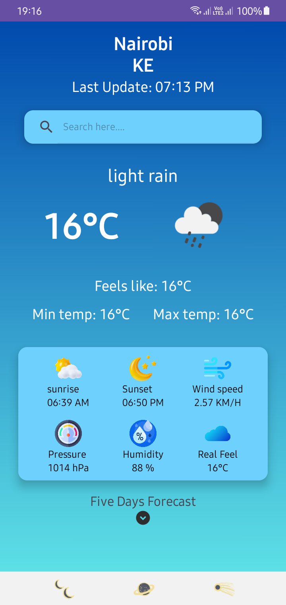
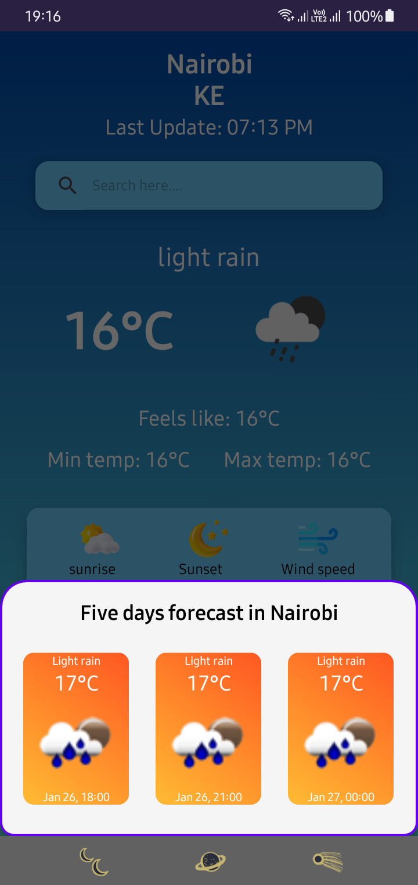

# Larana Weather App

A simple and intuitive Android weather app built using Kotlin. The app leverages the OpenWeather API to provide real-time weather updates for any location.

## Table of Contents

- [Features](#features)
- [Screenshots](#screenshots)
- [Requirements](#requirements)
- [Setup and Installation](#setup-and-installation)
- [Build and Run Instructions](#build-and-run-instructions)
- [Approach](#approach)
- [Challenges and Solutions](#challenges-and-solutions)
- [Contributing](#contributing)
- [License](#license)

## Features

- Fetch real-time weather data for any location using the OpenWeather API.
- Displays current temperature, weather conditions and humidity.
- Interactive search feature for finding weather in specific cities.
- Elegant and user-friendly interface.
- Supports Celsius temperature units.
- Offline support using Room for local data storage.

## Screenshots

**Home Screen**  


**Weather Details**  


**Offline Screen**


## Requirements

- **Android Studio**: Version Meerkat or newer.
- **Kotlin SDK**: Version 2.0 or newer.
- **Gradle**: Version 8.11.0 or newer.
- **API Level**: Minimum 24 (Android 7.0).
- **OpenWeather API Key**: [Get your API key here](https://openweathermap.org/api).

## Setup and Installation

1. **Clone the Repository**

   ```bash
   git clone https://github.com/samwelnyandoro/Weather-App.git
   ```
   ```bash
   cd Weather-App
   ```

2. **Open the Project in Android Studio**

   - Open Android Studio and select **File > Open...**.
   - Navigate to the cloned repository and open the project.

3. **Sync Gradle Files**

   - Android Studio will prompt you to sync Gradle files.
   - Click **Sync Now** and ensure there are no errors.

4. **Set up the OpenWeather API Key**

   - Go to the `values/strings.xml` file in the project root.
   - Add your API key as follows:
     ```properties
     <string name="api_key">your_api_key</string>
     ```

5. **Enable Location Permissions**

   - Ensure your AndroidManifest.xml includes location permissions for accessing user location.

## Build and Run Instructions

1. **Build the Project**

   - In Android Studio, select **Build > Rebuild Project**.

2. **Run the App**

   - Connect an Android device or start an emulator.
   - Click **Run > Run 'app'** or press **Shift + F10**.

3. **Test the App**

   - Enter a city name in the search bar to fetch and display its weather data.
   - Check offline mode by disconnecting from the network; previously fetched data should still be available.

## Approach

1. **Requirement Gathering**:
   - Identified the need for a weather app with a clean, user-friendly interface.
   - Selected the OpenWeather API for reliable and extensive weather data.

2. **Architecture**:
   - Used MVVM (Model-View-ViewModel) architecture to separate concerns.
   - Implemented Retrofit for API calls and LiveData for reactive UI updates.
   - Added Room for offline data persistence.

3. **Implementation**:
   - Integrated OpenWeather API using Retrofit and Gson.
   - Used ViewModel and LiveData for observing and managing weather data.
   - Implemented Room to cache weather data locally, ensuring offline support.
   - Designed intuitive UI layouts with Material Design principles.

## Challenges and Solutions

1. **Challenge**: Handling API rate limits.
   - **Solution**: Implemented caching with Room to store and serve data locally, reducing redundant API calls.

2. **Challenge**: Ensuring seamless performance on low-end devices.
   - **Solution**: Optimized API calls and reduced unnecessary background operations.

3. **Challenge**: Parsing complex JSON responses from OpenWeather API.
   - **Solution**: Used Gson for efficient deserialization and created data classes for mapping JSON responses.

4. **Challenge**: Managing offline access to weather data.
   - **Solution**: Used Room to store fetched weather data locally and provide access even when the device is offline.

## Contributing

Contributions are welcome! Please follow these steps:

1. Fork the repository.
2. Create a new branch: `git checkout -b feature-name`.
3. Commit your changes: `git commit -m 'Add some feature'`.
4. Push to the branch: `git push origin feature-name`.
5. Submit a pull request.

## License

This project is licensed under the [MIT License](LICENSE).
